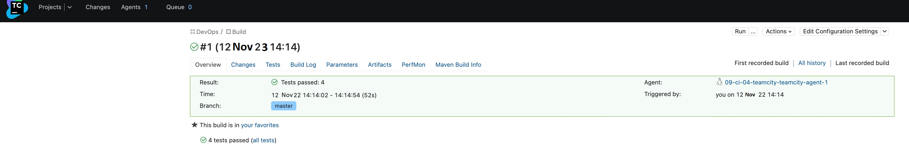
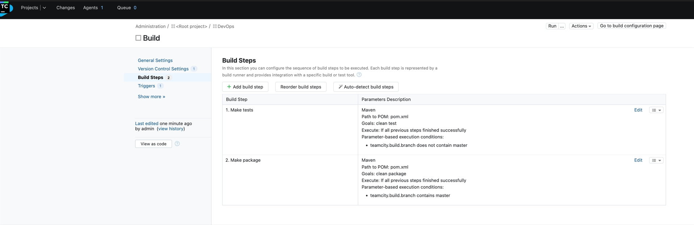
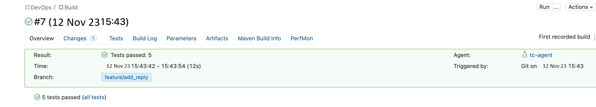

#### Основная часть

1. Создайте новый проект в teamcity на основе fork
2. Сделайте autodetect конфигурации
3. Сохраните необходимые шаги, запустите первую сборку master'a

4. Поменяйте условия сборки: если сборка по ветке `master`, то должен происходит `mvn clean package`, иначе `mvn clean test`

5. Мигрируйте `build configuration` в репозиторий  
[build configuration] сслыка settings.kts
6. Создайте отдельную ветку `feature/add_reply` в репозитории
7. Напишите новый метод для класса Welcomer: метод должен возвращать произвольную реплику, содержащую слово `hunter`
8. Дополните тест для нового метода на поиск слова `hunter` в новой реплике
9. Сделайте push всех изменений в новую ветку в репозиторий  
[feature/add_reply] https://github.com/pnagibin/09-ci-05-teamcity/tree/feature/add_reply
1.  Убедитесь что сборка самостоятельно запустилась, тесты прошли успешно

1.  Внесите изменения из произвольной ветки `feature/add_reply` в `master` через `Merge`
2.  Убедитесь, что нет собранного артефакта в сборке по ветке `master`
3.  Настройте конфигурацию так, чтобы она собирала `.jar` в артефакты сборки
4.  Проведите повторную сборку мастера, убедитесь, что сбора прошла успешно и артефакты собраны
5.  Проверьте, что конфигурация в репозитории содержит все настройки конфигурации из teamcity
6.  В ответ предоставьте ссылку на репозиторий  
[example-teamcity] https://github.com/pnagibin/09-ci-05-teamcity